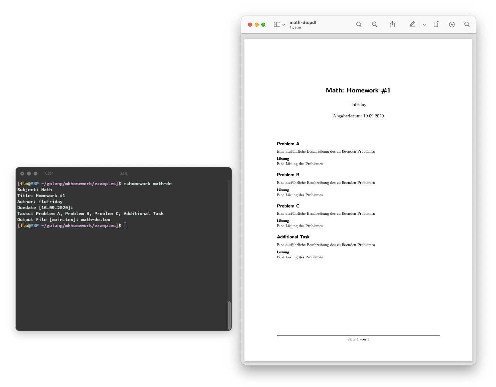

# mkhomework
Templates for my LaTeX homeworks and a script to automate the creation.

## Examples
In the example folder are LaTeX file and rendered PDFs.

## Install it
### Unix (Linux and macOS)
1) You need to have go installed
2) Run `bash install.sh`
3) Done

To uninstall it run `bash uninstall.sh` (this won't remove go from your system).

### Windows 
I don't quite know how to do this on Windows, but you could use 
WSL and follow the steps from the Unix description.